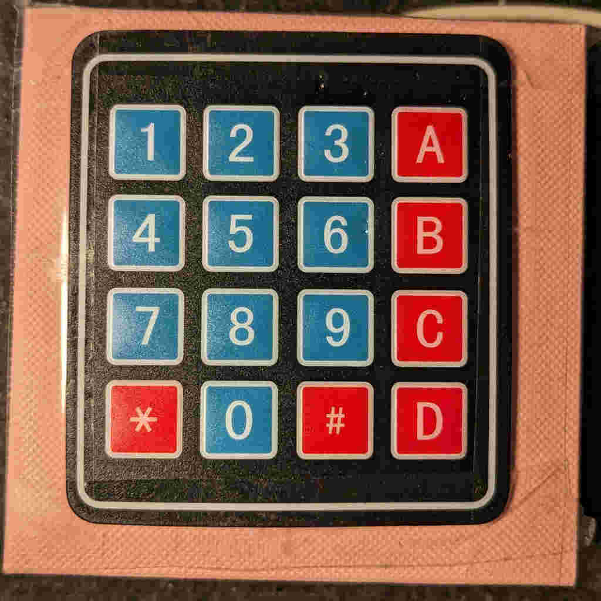
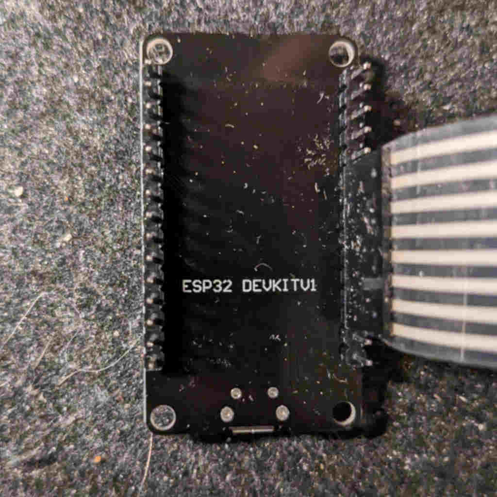
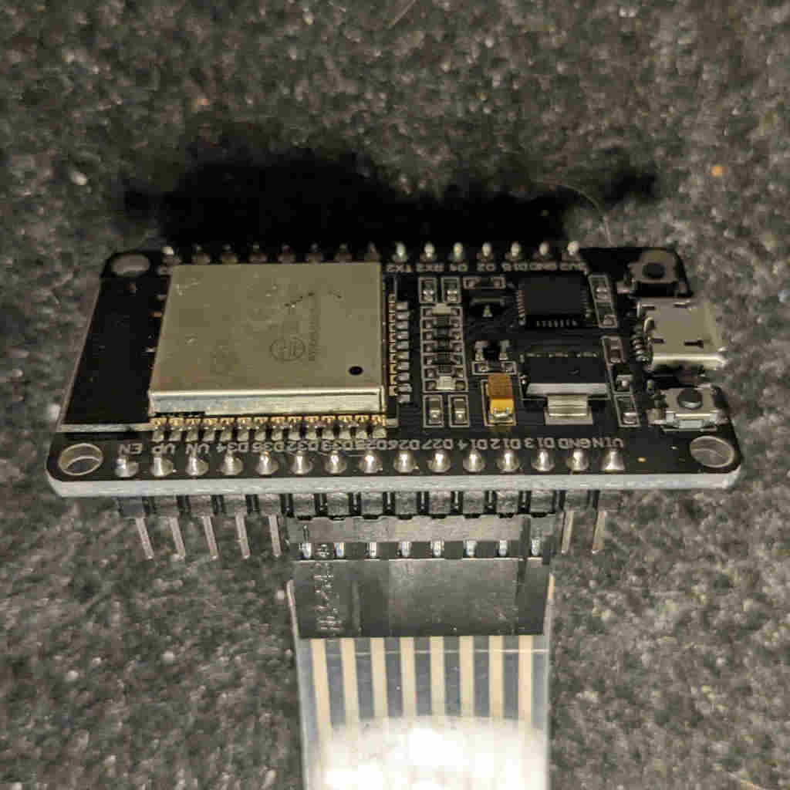

# Stream beg

A poor stream deck alternative for poor people.

## Hardware

You will need:

- A keypad that will cost you about 1-2 dollars.

- An ESP32 devkit for ~$5:

- A USB cable. The one that's in your drawer.
- A box. If you recently purchased jewelry for your wife, you may be able to find a good one.

## Dependencies

Keypad library by Mark Stanley, Alexander Brevig. I've tested it with version 3.1.1.

## Configuration

Check `CONFIGURATION.h` file. There should be all you need.

## TODOs

- Handle special keys and key combinations.
- Support an external LED to indicate the current process.
